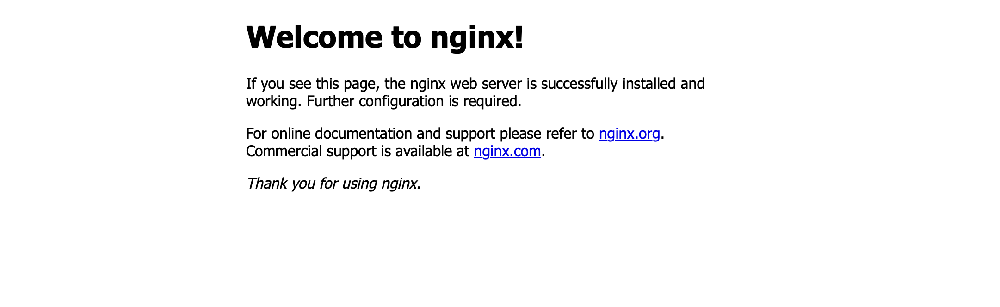
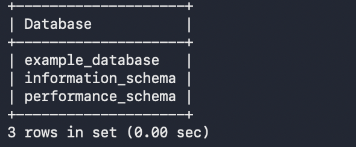
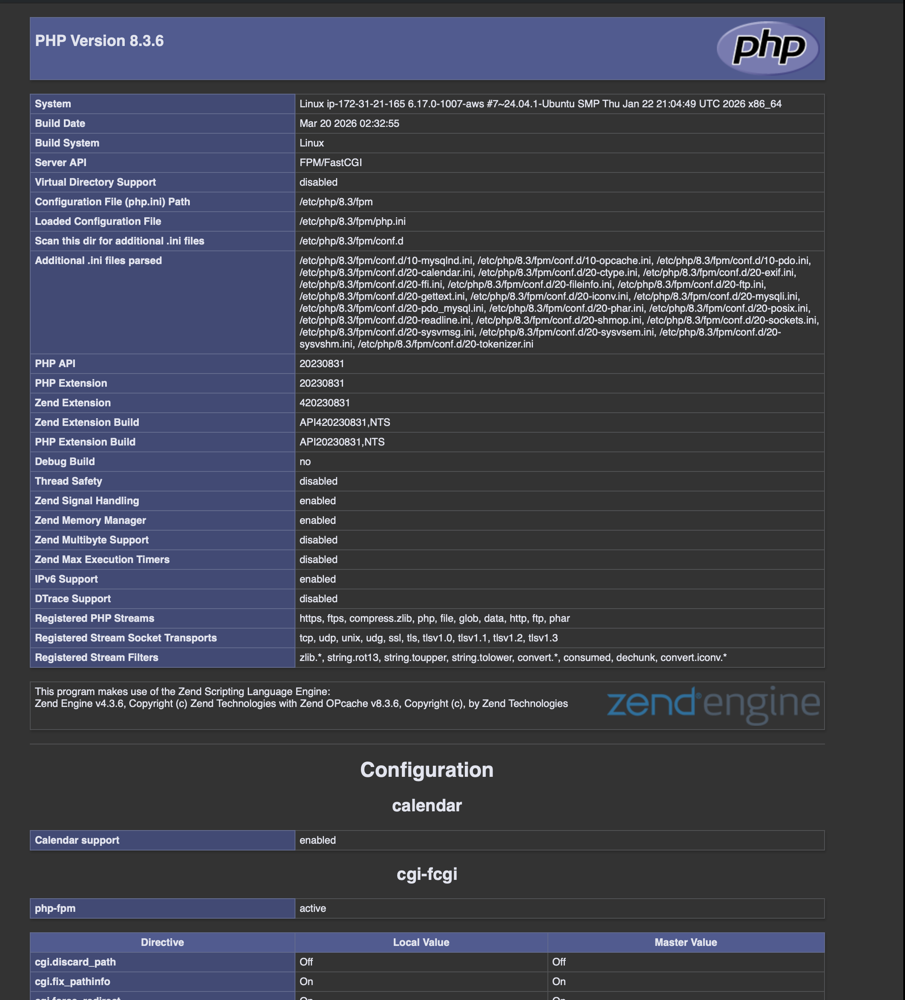

# LEMP STACK IMPLEMENTATION PROJECT


Project Overview

This project demonstrates the implementation of a LEMP stack (Linux, Nginx, MySQL, PHP) on an Ubuntu server hosted on AWS EC2.
A LEMP stack is a collection of open-source software used to build and deploy dynamic web applications. It consists of:

Linux (Operating System)
Nginx (Web Server)
MySQL (Database)
PHP (Server-side scripting)


☁️ Step 1: Launching an EC2 Instance

Created an Ubuntu EC2 instance on AWS
Configured security group:
SSH (Port 22)
HTTP (Port 80)

🔐 Step 2: Connecting to the Server
ssh -i nginx-key-pair.pem ubuntu@<your-public-ip>

🌐 Step 3: Installing Nginx Web Server
sudo apt update
sudo apt install nginx -y

Verify installation:
Open browser:
http://<your-public-ip>

📸 Nginx Welcome Page
## 📸 Nginx Welcome Page




## 🛢️ Step 4: Installing MySQL

```bash
sudo apt install mysql-server -y
```

### Secure MySQL Installation

```bash
sudo mysql_secure_installation
```

---

## 🔐 Step 5: Logging into MySQL

```bash
sudo mysql
```

---

## 🗄️ Step 6: Creating a Database and Table

### Create Database

```sql
CREATE DATABASE example_database;
```

### Create Table

```sql
CREATE TABLE example_database.todo_list (
    item_id INT AUTO_INCREMENT,
    content VARCHAR(255),
    PRIMARY KEY(item_id)
);
```

---

## ➕ Step 7: Inserting Data into Table

```sql
INSERT INTO example_database.todo_list (content) VALUES
("My first item"),
("My second item"),
("My third item"),
("My fourth item");
```

---

## 🔍 Step 8: Viewing Data

```sql
SELECT * FROM example_database.todo_list;
```

---

## 📸 MySQL Database Output

 

---

## 🐘 Step 9: Installing PHP

```bash
sudo apt install php-fpm php-mysql -y
```

---

## ⚙️ Step 10: Configuring Nginx for PHP

This step enables Nginx to process PHP files.

Open the Nginx configuration file:xxx

```bash
sudo nano /etc/nginx/sites-available/default
```

Inside the file, ensure this PHP processing block exists:

```nginx
location ~ \.php$ {
    include snippets/fastcgi-php.conf;
    fastcgi_pass unix:/var/run/php/php8.1-fpm.sock;
}
```

After saving the file, restart Nginx to apply changes:

```bash
sudo systemctl restart nginx
```

---

## 🧪 Step 11: Testing PHP Processing

Create a PHP test file in the web root directory:

```bash
sudo nano /var/www/projectLEMP/info.php
```

Add the following PHP code:

```php
<?php
phpinfo();
?>
```

Now open your browser and visit:

```
http://<your-public-ip>/info.php
```

---

## 📸 Step 12: PHP Output Screenshot



---
